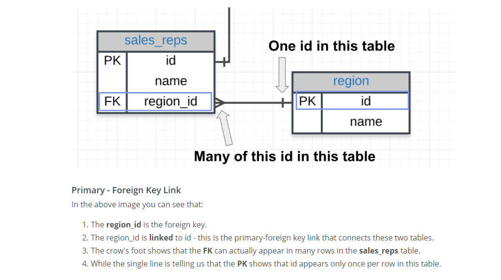
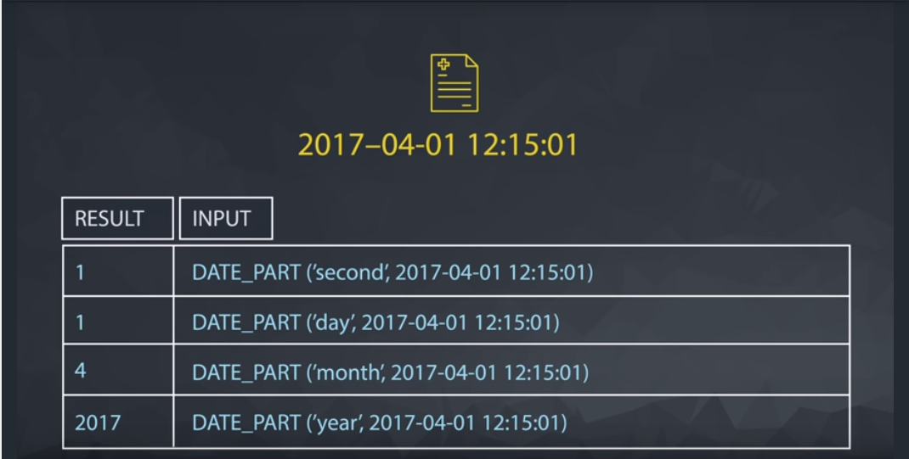

<!-- TOC -->

- [1. Descriptive Statistics](#1-descriptive-statistics)
    - [1.1. Intro to Research Methods](#11-intro-to-research-methods)
        - [1.1.1. Lesson 1 PDF](#111-lesson-1-pdf)
        - [1.1.2. Constructs](#112-constructs)
        - [1.1.3. Extraneous Factors](#113-extraneous-factors)
        - [1.1.4. Population Parameter](#114-population-parameter)
        - [1.1.5. Sample statistics](#115-sample-statistics)
        - [1.1.6. Correlation does not prove causation!](#116-correlation-does-not-prove-causation)
        - [1.1.7. Observational studies](#117-observational-studies)
        - [1.1.8. Surveys](#118-surveys)
        - [1.1.9. Controlled experiment](#119-controlled-experiment)
        - [1.1.10. Within subject design](#1110-within-subject-design)
        - [1.1.11. Indicator Response](#1111-indicator-response)
    - [1.2. Visualizing Data](#12-visualizing-data)
        - [1.2.1. Lesson 2 PDF](#121-lesson-2-pdf)
        - [1.2.2. Frequency Table](#122-frequency-table)
        - [1.2.3. Relative Frequency](#123-relative-frequency)
        - [1.2.4. Bar Chart](#124-bar-chart)
        - [1.2.5. Bar Graph](#125-bar-graph)
        - [1.2.6. Histogram](#126-histogram)
        - [1.2.7. InterActivate is a *histogram software*](#127-interactivate-is-a-histogram-software)
        - [1.2.8. Normal distribution](#128-normal-distribution)
        - [1.2.9. Positively skewed distribution](#129-positively-skewed-distribution)
    - [1.3. Central Tendency](#13-central-tendency)
        - [1.3.1. Lesson 3 PDF](#131-lesson-3-pdf)
        - [1.3.2. Mode](#132-mode)
        - [1.3.3. Mean](#133-mean)
        - [1.3.4. Median](#134-median)
    - [1.4. Variability](#14-variability)
        - [1.4.1. Lesson 4 PDF](#141-lesson-4-pdf)
        - [1.4.2. Interquartile Range (IQR)](#142-interquartile-range-iqr)
        - [1.4.3. Outliers](#143-outliers)
        - [1.4.4. Boxplots](#144-boxplots)
        - [1.4.5. Deviation (from the *mean*/average)](#145-deviation-from-the-meanaverage)
        - [1.4.6. Squared deviations](#146-squared-deviations)
        - [1.4.7. SS](#147-ss)
        - [1.4.8. variance](#148-variance)
        - [1.4.9. Standard Deviation](#149-standard-deviation)
        - [1.4.10. Bessel's Correction](#1410-bessels-correction)
    - [1.5. Standardizing](#15-standardizing)
        - [1.5.1. Lesson 5 PDF](#151-lesson-5-pdf)
        - [1.5.2. Standardizing](#152-standardizing)
        - [1.5.3. Continuous Distribution](#153-continuous-distribution)
        - [1.5.4. Z](#154-z)
        - [1.5.5. Z-Score](#155-z-score)
        - [1.5.6. Standard Normal Distribution](#156-standard-normal-distribution)
    - [1.6. Normal Distribution](#16-normal-distribution)
        - [1.6.1. Lesson 6 PDF](#161-lesson-6-pdf)
        - [1.6.2. Normal Distribution](#162-normal-distribution)
        - [1.6.3. Probability Density Function (PDF)](#163-probability-density-function-pdf)
    - [1.7. Sampling Distributions](#17-sampling-distributions)
        - [1.7.1. Lesson 7 PDF](#171-lesson-7-pdf)
        - [1.7.2. Samples:](#172-samples)
        - [1.7.3. Sampling Distribution](#173-sampling-distribution)
        - [1.7.4. Expected Value](#174-expected-value)
        - [1.7.5. Standard Error (SE)](#175-standard-error-se)
        - [1.7.6. Central Limit Theorem](#176-central-limit-theorem)
        - [1.7.7. Other Key TakeAways](#177-other-key-takeaways)
- [2. Python](#2-python)
    - [2.1. Control Flow](#21-control-flow)
        - [2.1.1. Zip()](#211-zip)
        - [2.1.2. List Comprehensions](#212-list-comprehensions)
    - [2.2. Functions](#22-functions)
        - [2.2.1. Documentation](#221-documentation)
        - [2.2.2. Lambda Expressions](#222-lambda-expressions)
        - [2.2.3. Map](#223-map)
        - [2.2.4. Filter](#224-filter)
        - [2.2.5. Iterators and Generators](#225-iterators-and-generators)
    - [2.3. Scripting](#23-scripting)
- [3. SQL](#3-sql)
    - [3.1. Basic SQL](#31-basic-sql)
        - [3.1.1. Entity Relationship Diagram (ERD)](#311-entity-relationship-diagram-erd)
        - [3.1.2. Primary Key (PK)](#312-primary-key-pk)
        - [3.1.3. Foreign Key (FK)](#313-foreign-key-fk)
    - [3.2. JOINS](#32-joins)
        - [3.2.1. JOIN == INNER JOIN](#321-join--inner-join)
        - [3.2.2. LEFT JOIN == LEFT INNER JOIN == LEFT OUTER JOIN](#322-left-join--left-inner-join--left-outer-join)
        - [3.2.3. RIGHT JOIN == RIGHT INNER JOIN == RIGHT OUTER JOIN](#323-right-join--right-inner-join--right-outer-join)
        - [3.2.4. OTHER TYPES OF JOINS](#324-other-types-of-joins)
    - [3.3. AGGREGATIONS](#33-aggregations)
        - [3.3.1. NULL](#331-null)
        - [3.3.2. COUNT & SUM](#332-count--sum)
        - [3.3.3. MIN & MAX](#333-min--max)
        - [3.3.4. AVG](#334-avg)
        - [3.3.5. MEDIAN](#335-median)
        - [3.3.6. GROUP BY](#336-group-by)
        - [3.3.7. DISTINCT](#337-distinct)
        - [3.3.8. HAVING](#338-having)
        - [3.3.9. Misc Notes](#339-misc-notes)
        - [3.3.10. DATE_TRUNC](#3310-date_trunc)
        - [3.3.11. DATE_PART](#3311-date_part)
        - [3.3.12. CASE](#3312-case)
    - [3.4. Subqueries & Temporary Tables](#34-subqueries--temporary-tables)
        - [3.4.1. Subqueries](#341-subqueries)
        - [3.4.2. WITH](#342-with)
    - [3.5. SQL Data Cleaning](#35-sql-data-cleaning)
        - [3.5.1. LEFT and RIGHT](#351-left-and-right)
        - [3.5.2. POSITION, STRPOS, SUBSTR](#352-position-strpos-substr)
        - [3.5.3. other things:](#353-other-things)
        - [3.5.4. CONCAT](#354-concat)
        - [3.5.5. CAST](#355-cast)
        - [3.5.6. COALESCE](#356-coalesce)

<!-- /TOC -->
# 1. Descriptive Statistics

## 1.1. Intro to Research Methods

### 1.1.1. Lesson 1 PDF
- [Lesson 1 PDF](Lesson1.pdf)

### 1.1.2. Constructs
- In scientific theory, particularly psychology, a hypothetical construct is an explanatory variable which is not directly observable. (itchiness, happiness, stress, intelligence, motivation, etc)

- measured with an **operational definition**.
- For instance, *happiness* could be measured by the ratio of minutes spent smiling to minutes not smiling. Here, the ratio is the **operational definition** of *happiness*.

### 1.1.3. Extraneous Factors
- aka lurking variables
- things that could influence the outcome, that aren't necessarily considered. (the surprise unknowns)

### 1.1.4. Population Parameter
- denoted by <code>$\mu$</code> (mu)
- are values that describe the ENTIRE population (as an average)

### 1.1.5. Sample statistics
- denoted by <code>$\bar{x}$</code> (x-bar)
- are values that describe a sample (the sample that were tested) (as an average)

We use <code>$\bar{x}$</code> to estimate <code>$\mu$</code>.

**Independent** or the **predictor** variable - the x-axis variable

**Dependent** or the **outcome** variable is the y-axis variable

---
---
### 1.1.6. Correlation does not prove causation!
---
---
### 1.1.7. Observational studies
- To show relationships.
- Just ask people and you'll see a trend.

### 1.1.8. Surveys
- a type of observational study
- **response bias** - when respondents don't understand a question
- **non-response bias** - when they refuse to answer a question

### 1.1.9. Controlled experiment
- to show **causation**
- to deal with all the extraneous factors (lurking variables)

### 1.1.10. Within subject design
- controlling for variation within a person.
- For example, testing after different amounts of sleep. You're controlling the variation in people's individual memory capabilities, depending on the amounts of sleep they got.

### 1.1.11. Indicator Response
- ex. Pouched rats scratching near tea eggs containing TNT. So I guess it's *indicating* that TNT is nearby. The humans needed some kind of **indicator response** from the mice to know when there was TNT nearby.

---

## 1.2. Visualizing Data

### 1.2.1. Lesson 2 PDF
- [Lesson 2 PDF](Lesson2.pdf)

### 1.2.2. Frequency Table
- counts the frequency of each data type (ie, if countries, then each country)
- they are whole numbers, obviously, since it's a count.

### 1.2.3. Relative Frequency
- How much of the whole each data point comprises.
- **Absolute** numbers are whole numbers (12 or 43 out of 50)
    - the sum is the number of data points (<code>$n$</code> or <code>$N$</code>)
- **Proportions** are the fraction written with decimals (.24 or .86)
    - the sum is 1
- **Percentages** are with the <code>%</code> sign (24% or 86%)
    - the sum is 100%

### 1.2.4. Bar Chart
- measures **frequency** of your data, which is grouped into **intervals** or **bins**
- the **intervals** are on the x-axis
- the **frequency** is on the y-axis

### 1.2.5. Bar Graph
- data is grouped **categorically** or **qualitatively**
- can't be grouped (much) differently because the groups are distinct categories
- space between data groupings

### 1.2.6. Histogram
- a type of bar chart
- data is grouped **numerically** or **quantitatively**
- *no* space between data groupings (unless frequency is 0)
- the **intersection of the axes** is (0,0) (Cartesian coordinates)
- can be *biased*! Always look at labels & numbers

### 1.2.7. InterActivate is a *histogram software*

### 1.2.8. Normal distribution
- one large, middle peak called the **mode**; symmetrical

### 1.2.9. Positively skewed distribution
- peak is on the left
- most values on the left

---
## 1.3. Central Tendency

### 1.3.1. Lesson 3 PDF
- [Lesson 3 PDF](Lesson3.pdf)

3 measures of center: mode, median, mean

### 1.3.2. Mode
- most common occurrence - ie, in [1, 2, 3, 4, 4] it's 4
- value at which the *frequency* is highest (the tallest peak)
- can be used for any data - *categorical* or *numerical*
- no actual formula for finding it.

### 1.3.3. Mean
- the **average** of the distribution
- ALL scores in distribution affect the mean
- mean of a sample denoted by <code>$\bar{x}$</code>
- mean of a population denoted by <code>$\mu$</code>
- formula for a sample: <code>$\bar{x} = \frac{\sum x}{n}$</code>
- formula for a population: <code>$\mu = \frac{\sum x}{N}$</code>
- many samples from the same population will have similar means (!!!)
- the mean of a sample can be used to make inferences about the population it came from (!!!)
- **outliers** - outlying data points that completely skew the average
[tough quiz](https://classroom.udacity.com/courses/ud002-bert/lessons/1489118552/concepts/773143370923)

### 1.3.4. Median
- value in the middle of the distribution
- if there are 2 numbers, it's the middle of the middles (the average of the middle 2 numbers)
- **ROBUST** = doesn't change much due to outliers
- best measure of central tendencies when dealing with highly skewed distributions
- formula for an even number of values:
<code>$\frac{x_\frac{n}{2} + x_{\frac{n}{2}+1}}{2}$</code>
- formula for an odd number of values: <code>$x_\frac{n+1}{2}$</code>

---
## 1.4. Variability

### 1.4.1. Lesson 4 PDF
- [Lesson 4 PDF](Lesson4.pdf)

### 1.4.2. Interquartile Range (IQR)
- divide the data into quarters, and subract the lower median from the upper median (Q3 - Q1). This is the IQR.
- roughly 50% of data is within this range
- IQR is **not affected by outliers**.
- more or less describes the spread of the data

### 1.4.3. Outliers
- extreme data points in a distribution
- traditionally cut off top and bottom 25%
- formula to determine outliers: <code>$Outlier < Q_1 - 1.5*(IQR)$</code>
- formula to determine outliers: <code>$Outlier > Q_3 - 1.5*(IQR)$</code>
- traditionally cut off top and bottom 25% of distributions to account for outliers

### 1.4.4. Boxplots
- used to visualize *quartiles* and *outliers*
- outer lines are the *min* and *max* values that are NOT outliers
- the whole box is the *IQR*
- the box edges are, as shown in image below, *Q1*, *Q2*, and *Q3*
- *outliers* are shown as dots outside of the *min* and *max* lines.


### 1.4.5. Deviation (from the *mean*/average)
- find the *mean*, then subtract each data point (find the absolute)
- <code>$x_i - \bar{x}$</code> (xi minus x-bar)
- how far from zero it is

### 1.4.6. Squared deviations
- just the *deviations* squared

### 1.4.7. SS
- sum of the squared deviations
- formula: <code>$\Sigma(x_i - \bar{x})^2$</code>

### 1.4.8. variance
- **SS** divided by <code>$n$</code>
- is the average squared deviation
- BUT if we treated the whole as a sample (<code>$n$</code>), it would be divided by (<code>$n - 1$</code>)
    - I don't know why

### 1.4.9. Standard Deviation
- denoted by (small sigma) <code>$\sigma$</code>
- square root of the variance (which is the average of squared deviations)
- the most common measure of spread
- formula: <code>$\sigma=\sqrt{\frac{\Sigma(x_i - \bar{x})^2}{n}}$</code>
- within a *normal distribution*, 68% of data sample falls within a 'standard deviation' from the mean, and 95% of the data sample falls within 2 'standard deviations' from the mean (see figure!).


### 1.4.10. Bessel's Correction
In general, samples under-estimate variability in a population because samples tend to be from the middle (especially in normal distribution).
- To correct for this, *Bessel's Correction*
- get average using <code>$(n-1)$</code> instead of <code>$n$</code>
- use this **ONLY** for approximating populations using samples
- it is **NOT** used for a whole population (or small data set)
- if you've got a sample, where <code>$n = 5$</code> and population is <code>$N = 100$</code>, then use Bessel's Correction.
- denoted by (small s) <code>$s$</code>

**Sample standard deviation** is the standard deviation of a sample (not a population), and it uses *Bessel's Correction* to approximate the population. Its formula is: <code>$s \approx \sqrt{\frac{\Sigma(x_i - \bar{x})^2}{n-1}}$</code>

Variance with Bessel's Correction (for a sample): <code>$\frac{\Sigma(x_i = \bar{x})^2}{n-1}$</code>

---
## 1.5. Standardizing

### 1.5.1. Lesson 5 PDF
- [Lesson 5 PDF](Lesson5.pdf)

### 1.5.2. Standardizing
This term is used to compare 2 different distributions (ie Twitter vs Facebook followers). Basically, we compare them using their standard deviations as the common unit. For example, we would compare how many standard deviations away from the mean (which is our zero starting point) that our Z-value is.
- proportion below or above the mean

### 1.5.3. Continuous Distribution
A theoretical model:
- a theoretically continuous (smooth) distribution that can be described with an equation, which calculates the proportion between ANY 2 points on the x-axis.
- area under the curve should be 1 (same as the sum of all the relative frequencies)

In our theoretical model of a *continuous* and *normal* distribution, the *mean*, *median*, and *mode* are all equal.

### 1.5.4. Z
- Marks a point on the x-axis of a distribution

### 1.5.5. Z-Score
- in a standard distribution, the distance in st.dev's away from mean.
    - to calculate this Z-value in terms of standard deviations away from the mean,
we need to know:
        - the Z value/number
        - the mean
        - the standard deviation
    - and then take the difference (mean minus Z) divided by the stand.dev.
- <code>$Z.Score = \frac{x-\mu}{\sigma}$</code> where <code>$x - \mu$</code> will be positive or negative, depending on whether above or below the *mean*.

### 1.5.6. Standard Normal Distribution
Q: What is the standard deviation of a standardized distribution?

A: The z-score of sigma will be 1:

<code>$Z = \frac{x - \mu}{\sigma} = \frac{\sigma - 0}{\sigma} = 1$</code>

This is called the **Standard Normal Distribution**.


---
## 1.6. Normal Distribution

### 1.6.1. Lesson 6 PDF
- [Lesson 6 PDF](Lesson6.pdf)

### 1.6.2. Normal Distribution
- bell curve with peak in the center
- the tails never actually touch the x-axis, they just infinitely approach it
    - because we can never be 100% sure that there isn't a value further than that; theoretically, you can have an infinite values in a population


### 1.6.3. Probability Density Function (PDF)
- the curve of a *normal distribution*
- because the area under the curve is 1
    - so we can get the probability of any number on x-axis (aka %)
- there is an extra-curricular equation for this (via calculus)
    - someone created a table for greater ease!
- the *area under the curve* of a normal distribution == the *probability* of randomly selecting less than x == the *proportion* in the sample/population with scores less than x
    - where x is the xth percentile (or the Z)


<code>$s \approx \sqrt{\frac{\Sigma(x_i - \bar{x})^2}{n-1}}$</code>

<code>$Zscore = \frac{\mu -Z}{\sigma}$</code>, and then look up the *area under the curve* on the chart to get the *probability* of data scores less than *X* (or *Z*)

---
## 1.7. Sampling Distributions

### 1.7.1. Lesson 7 PDF
- [Lesson 7 PDF](Lesson7.pdf)

With a single data point, we can compare that value to the rest of the values with *% less* or *% greater*.
Similarly, if we have a sample, we can compare that sample to the rest of the samples!

### 1.7.2. Samples:
- A sample must represent the characteristics of the population.
    - It needs to be *large enough*,
    -  to *have similar characteristics* to the *whole* population
        - ie, if population has 70% women vs men, then sample must have about the same
        - the sample mean should be similar to the population mean.
            - That's how you can tell if your sample is large enough. (??)

### 1.7.3. Sampling Distribution
- the distribution of samples means is the **sampling distribution**
    - the shape will be a *normal distribution*
    - if we calculate *ALL* the sample means, the mean of these sample means (or, the mean of the *sampling distribution*) will equal the population's mean.
        - <code>if $\mu$ of 100% of sampling distribution, then $\mu = M$</code>

### 1.7.4. Expected Value
- the mean of a population is the *expected value*, even if it's not a possible outcome (as in dice rolls).
- it means we can expect an outcome somewhere around this value.

### 1.7.5. Standard Error (SE)
- the standard deviation of the sampling distribution
- the population standard deviation divided by the square root of n: <code>$SE = \frac{\sigma}{\sqrt{n}}$</code>
- So if you have a population size of 1,


### 1.7.6. Central Limit Theorem
- for any population, if you take enough samples, and plot those samples' means, you'll get roughly a normal distribution
- aka the *standard error (SE)*
- So:
    - the distribution of means,
    - where every mean is the mean of a sample of size <code>$n$</code>,
    - has a standard deviation equal to the population standard deviation divided by the square root of <code>$n$</code>.

### 1.7.7. Other Key TakeAways
- the larger the sample size (in a population of samples) (ie. n=2 or n=25),
    - the narrower the histogram/ distribution. Which means:
        - the smaller the *Standard Error*
        - the Z-Score will be bigger for the same data point
        - the less likely to get an outlying data point

---
---

# 2. Python

## 2.1. Control Flow
This is lesson 25. I skipped what was review for me.

### 2.1.1. Zip()
<code>zip</code>
    - returns an iterator
    - combines multiple iterables into a sequence of tuples
        - each tuple contains the elements in that position from all the iterables.

General example:
```
list( zip(['a', 'b', 'c'], [1, 2, 3]) )
```
outputs
```
[('a', 1), ('b', 2), ('c', 3)]
```

Example using `for` loop:

```
letters = ['a', 'b', 'c']
nums = [1, 2, 3]

for letter, num in zip(letters, nums):
    print( "{}: {}".format(letter, num) )
```

`zip` also works in reverse (unzipping).
Example:
```
some_list = [('a', 1), ('b', 2), ('c', 3)]

letters, nums = zip(*some_list)
```

### 2.1.2. List Comprehensions
These are a sort of shortcut. It allows us to create a list using a `for` loop in a single step!
- not found in any other language, but very common in Python. :)

```
capitalized_cities = []
for city in cities:
    capitalized_cities.append( city.title() )
```

can be reduced to:
```
capitalized_cities = [city.title() for city in cities]
```

Used with conditionals:
```
squares = [x**2 for x in range(9) if x % 2 == 0]
```

With an `else`:
```
squares = [x**2 if x % 2 == 0 else x + 3 for x in range(9)]
```
---
## 2.2. Functions

### 2.2.1. Documentation
```
def population_density(population, land_area):
    """Calculate the population density of an area.
    INPUT:
    population: int. The population of the area
    land_area: int or float. This function is unit-agnostic,
    if you pass in values in terms of square km or square miles
    the function will return a density in those units.
    OUTPUT:
    population_density: population/land_area.
    The population density of a particular area.
    """
    return population / land_area
```

### 2.2.2. Lambda Expressions
Used to create quick, "throw-away" anonymous functions.
```
def multiply(x, y):
    return x * y
```
can be reduced to:
```
multiply = lambda x, y: x * y
```

### 2.2.3. Map
`map` takes in a `function` and an `iterable` as inputs, and returns an interator that applies the function to each element of the iterable.

```
numbers = [
              [34, 63, 88, 71, 29],
              [90, 78, 51, 27, 45],
              [63, 37, 85, 46, 22],
              [51, 22, 34, 11, 18]
           ]


def mean(list):
    return sum(list) / len(list)

averages = list(map(mean, numbers))
print(averages)
```
With `lambda`:
```
averages = list(map(lambda x: sum(x) / len(x), numbers))
```

### 2.2.4. Filter
`filter` takes a `function` and `iterable` as inputs, just like `map`, and returns an iterator with the elements from the iterable *for which the function returns `True`*.
```
cities = ["New York City", "Los Angeles", "Chicago", "Mountain View", "Denver", "Boston"]

def is_short(name):
    return len(name) < 10

short_cities = list(filter(is_short, cities))
print(short_cities)
```
With `lambda`:
```
short_cities = list(filter(lambda x: len(x) < 10))
```

### 2.2.5. Iterators and Generators

*Iterables* are objects that can return one of their elements at a time, such as a list. Mny of the built-in functions we've used so far, like `enumerate`, return an iterator.

An *iterator* is an object that represents a *stream of data*. This is different from a list, which is also an iterable, but not an iterator because it is not a stream of data.

*Generators* are a simple way to create iterators using functions. You can also define iterators using *classes*.

Why would we use them rather than a list? Here's an excerpt [from stack overflow](https://softwareengineering.stackexchange.com/questions/290231/when-should-i-use-a-generator-and-when-a-list-in-python/290235):

    Generators are a lazy way to build iterables. They are useful when the fully realized list would not fit in memory, or when the cost to calculate each list element is high and you want to do it as late as possible. But they can only be iterated over once.


Example of a generator function called `my_range`, which produces an iterator that is a stream of numbers from 0 to (x-1).
```
def my_range(x):
    i = 0
    while i < x:
        yield i
        i += 1
```
Notice that is uses `yield`. This allows the function to return values, but to continue on.
- This `yield` keyword is what differentiates a generator from a typical function.
- Also note that you cannot create generators with code that defines the iterator (ie `result = []`) before the loop!

**
You can combine generators and list comprehensions!
Create a generator in the same way you'd normally wrie a list comprehension, except with parenthesis instead of square brackets. Example:
```
sq_list = [x**2 for x in range(10)]

sq_iterator = (x**2 for x in range(10))
```

The 1<sup>st</sup> example produces a list of squares.
The 2<sup>nd</sup> example produces an iterator of squares

---
## 2.3. Scripting
---
---
# 3. SQL
## 3.1. Basic SQL
```
SELECT [columns] (or * for all)
FROM <table>
WHERE column = exactly 'known'
               LIKE '%whatever%'
               IN ('multiple', 'conditions')
               NOT LIKE (or NOT IN) '%whatever%'
               AND all true things
               BETWEEN all true things
               OR at least 1 true thing
ORDER BY column
LIMIT 10;
```

### 3.1.1. Entity Relationship Diagram (ERD)

- the "map" of the tables & data columns in a database
- it's a key element to understanding how we can pull data from multiple tables
- Choosing the setup of data in a database is very important, but not usually the job of a data analyst. The process is known as **Database Normalization**.

### 3.1.2. Primary Key (PK)
- exists in every table
- has a unique value for EVERY row
- commonly the first column in tables, in most databases

### 3.1.3. Foreign Key (FK)
- a column that has the same data as a *primary key* in another (linked) table.
-ex: A table called `sales_reps` has PK column called `id` and a FK column called `region_id`.
    - A linked table called `region` has a PK column called `id`.
    - The `region` table's PK has the same values as `sales_reps`'s FK values.



---
## 3.2. JOINS
### 3.2.1. JOIN == INNER JOIN
- basic joins
- pulls info *common to BOTH* tables

### 3.2.2. LEFT JOIN == LEFT INNER JOIN == LEFT OUTER JOIN
- pulls info common to both tables AND all remaining info from the table in the `FROM` clause

### 3.2.3. RIGHT JOIN == RIGHT INNER JOIN == RIGHT OUTER JOIN
- pulls info common to both tables AND all remaining info from the table in the `JOIN` clause

The left & right joins only depend which table you put in the `FROM` and the `JOIN` clause.

### 3.2.4. OTHER TYPES OF JOINS
- The `FULL OUTER JOIN` is extremely rarely used
    - mainly used for exception lists
- `UNION` and `UNION ALL`
- `CROSS JOIN`
- `SELF JOIN` is tricky

---
## 3.3. AGGREGATIONS

### 3.3.1. NULL
- where a cell is blank
    - different from a space or having 0
- NULL is not a value, but a *property* of the data
- `WHERE` cell `IS NULL` or `WHERE` cell `IS NOT NULL`
- `COUNT(*)` returns all the rows that have some non-null data.
    - since rows generally are not `NULL` all the way across, it returns the count of all your rows of data.

### 3.3.2. COUNT & SUM
`SELECT COUNT(*)`
`SELECT SUM(cell)`
    - returns a single row & column with the count of non-null rows

### 3.3.3. MIN & MAX
- returns the min or max of a column of values.
- ignores all NULL values

### 3.3.4. AVG
- returns the average (sum/count) of not-null values

### 3.3.5. MEDIAN
(reminder: median is the middle-most value. Or, if there are 2 middle-most values, it's the average of the 2)
- Median might be a more appropriate measure of center for this data, but finding the median happens to be a pretty difficult thing to get using SQL alone
    -- SO DIFFICULT that finding a median is occasionally asked as an `interview question`!

### 3.3.6. GROUP BY
- to aggregate data within subsets of the data.
    - ex. group sum of 3 types of paper *per account*
- as in the above example, any column in the `SELECT` clause that is NOT within an aggregator MUST be in the `GROUP BY` clause
- alway goes between `WHERE` and `ORDER BY`
    - `ORDER BY` works like `sort` in a spreadsheet.

It is worth noting that SQL evaluates the aggregations before the LIMIT clause. If you don’t group by any columns, you’ll get a 1-row result—no problem there. If you group by a column with enough unique values that it exceeds the LIMIT number, the aggregates will be calculated, and then some rows will simply be omitted from the results.

This is actually a nice way to do things because you know you’re going to get the correct aggregates. If SQL cuts the table down to 100 rows, then performed the aggregations, your results would be substantially different.

### 3.3.7. DISTINCT
- goes within the `SELECT` clause
- you select all rows with distinct (no duplicates) across all rows
    - ex. (0,0), (0, 1), (1, 0), and (1, 1) are all distinct tuples. There are no more possible tuples with either a 1 or 0 in it.


### 3.3.8. HAVING
- just like the `WHERE` clause, except using an aggregation
- placed after `WHERE` and `GROUP BY`, but before `ORDER BY`

### 3.3.9. Misc Notes
For this statement:
```SQL
SELECT a.id, a.name, SUM(o.total_amt_usd) total_spent
FROM accounts a
JOIN orders o
ON a.id = o.account_id
GROUP BY a.id, a.name
HAVING SUM(o.total_amt_usd) < 1000
ORDER BY total_spent;
```
the `HAVING` statement is evaluated before the `SELECT` statement, so the client won't know about the alias!

### 3.3.10. DATE_TRUNC
- for truncating dates, since the dates include time (so are all unique!)
- databases should automatically format the date as YYYY-MM-DD instead of the American DD-MM-YYYY or the global MM-DD-YYYY (which, frankly, is super confusing!)
- `GROUP BY` and `ORDER BY` should use the same metric (`DATE_TRUNC('day', occurred_at)`)

`SELECT DATE_TRUNC('day', occurred_at)`  truncates to the day.

### 3.3.11. DATE_PART
- allows you to pull the part of the date that you want
- includes `'dow'` for day of the week
    - result is 0 through 6, which is Sunday to Saturday




### 3.3.12. CASE
- `CASE` statement is SQL's `IF-THEN` logic!
- always goes in the `SELECT` clause
- `CASE` followed by at least 1 pair of `WHEN` & `THEN` statements
    - and must finish with the word `END`
    - can include *operators* like `LIKE`, `AND`, `OR`, etc.
    - can include an `ELSE` statement
```sql
SELECT account_id, CASE WHEN standard_qty = 0 OR standard_qty IS NULL THEN 0
                        ELSE standard_amt_usd/standard_qty END AS unit_price
FROM orders
LIMIT 10;
```
Below, we're creating 2 columns. Total_group to classify over or under 500, and order_count that tallies each classification!
```sql
SELECT CASE WHEN total > 500 THEN 'Over 500'
            ELSE '500 or under' END AS total_group,
       COUNT(*) AS order_count
FROM orders
GROUP BY 1;
```


## 3.4. Subqueries & Temporary Tables

### 3.4.1. Subqueries
- a query within a query
- the subquery is in the `FROM` clause:
    - instead of: `FROM table1`, the line is something like:
```SQL
SELECT channel, events
FROM (
    SELECT DATE_TRUNC('day', occurred_at) AS day, channel, COUNT(*) as events
    FROM web_events
    GROUP BY 1, 2
    ORDER BY 3 DESC
    ) AS subq
GROUP BY channel
ORDER BY 2 DESC;
```
- a *subquery* MUST use an alias, as in the example above
- can be used anywhere you use any:
    - table, column, or even individual value

Here is 1 quiz that I kept as an example:
Provide the name of the sales_rep in each region with the largest amount of total_amt_usd sales.
- rep and their total_usd:

```sql
SELECT t2.region, t3.rep, t2.max_tot
FROM (
    SELECT r.name region, MAX(t1.total) AS max_tot
    FROM (
        SELECT s.region_id, s.name rep, SUM(o.total_amt_usd) total
        FROM orders o
        JOIN accounts a
        ON a.id = o.account_id
        JOIN sales_reps s
        ON s.id = a.sales_rep_id
        GROUP BY 1, 2
        ORDER BY 3 DESC) AS t1
    JOIN region r
    ON r.id = t1.region_id
    GROUP BY 1
    ORDER BY 2 DESC) AS t2
JOIN (
    SELECT s.name rep, SUM(o.total_amt_usd) total
    FROM orders o
    JOIN accounts a
    ON a.id = o.account_id
    JOIN sales_reps s
    ON s.id = a.sales_rep_id
    GROUP BY 1
    ORDER BY 2 DESC ) AS t3
ON t2.max_tot = t3.total
```

### 3.4.2. WITH
- often called a **Common Table Expression** or **CTE**
- serve the same purpose as a subquery, but:
    - cleaner reading
    - better performance times (can be)

The subquery example above can be rewritten as follows:
```sql
WITH t1 as (
    SELECT s.region_id, s.name rep, SUM(o.total_amt_usd) total
    FROM orders o
    JOIN accounts a
    ON a.id = o.account_id
    JOIN sales_reps s
    ON s.id = a.sales_rep_id
    GROUP BY 1, 2
    ORDER BY 3 DESC),

    t2 as (
        SELECT r.name region, MAX(t1.total) AS max_tot
        FROM t1
        JOIN region r
        ON r.id = t1.region_id
        GROUP BY 1
        ORDER BY 2 DESC),

    t3 as (
        SELECT s.name rep, SUM(o.total_amt_usd) total
        FROM orders o
        JOIN accounts a
        ON a.id = o.account_id
        JOIN sales_reps s
        ON s.id = a.sales_rep_id
        GROUP BY 1
        ORDER BY 2 DESC )

SELECT t2.region, t3.rep, t2.max_tot
FROM t2
JOIN t3
ON t2.max_tot = t3.total
```
Beautiful!!!

## 3.5. SQL Data Cleaning

### 3.5.1. LEFT and RIGHT
- pulls out a certain number of characters from the `LEFT` or `RIGHT`
```sql
SELECT first_name,
       last_name,
       LEFT(phone_number, 3) AS area_code,
       RIGHT(phone_number, 8) AS phone_number_only,
FROM customer_data;
```
- can also put in a `LENGTH` rather than hard-coding a certain number.
    - ex instead of `RIGHT(phone_number, 8) AS phone_number_only`, it could be `RIGHT(phone_number, LENGTH(phone_number) - 4) AS phone_number_alt`

### 3.5.2. POSITION, STRPOS, SUBSTR
- `POSITION`: provides the position of a string (first arg) counting from the left.
- case sensitive
    - for example, if you have city and provinces in a single column, and want to separate them:
        - POSITION(',' IN city_state) AS comma_position

- `STRPOS` for *string position* is the same thing!
- also case sensitive
    - for the same example as above:
        - STRPOS(city_state, ',') AS substr_comma_position

### 3.5.3. other things:
- `UPPER()` and `LOWER()` makes a string upper or lower case
    - `UPPER(`string`)` AS uppercase
- some functions CAN be nested!
    - LEFT( UPPER(string) )
    - LEFT(city_state, POSITION(',' IN city_state)-1 ) AS city
        - the minus 1 after `POSITION` is so we do not include the comma in our string!
    -

Use the accounts table to create first and last name columns that hold the first and last names for the primary_poc.
```sql
SELECT LEFT(primary_poc, POSITION(' ' IN primary_poc)) AS first_name,
	   RIGHT(primary_poc, LENGTH(primary_poc) - STRPOS(primary_poc, ' ')) AS last_name
FROM accounts
```

### 3.5.4. CONCAT
- concatenate multiple values into a single column
- both `CONCAT` and `||` can be used to concat strings together!
- The following are both equivalent:
    ```sql
    SELECT first_name || ' ' || last_name AS full_name
           CONCAT(first_name, ' ', last_name) AS full_name_alt
    ```

We would also like to create an initial password, which they will change after their first log in. The first password will be the first letter of the primary_poc's first name (lowercase), then the last letter of their first name (lowercase), the first letter of their last name (lowercase), the last letter of their last name (lowercase), the number of letters in their first name, the number of letters in their last name, and then the name of the company they are working with, all capitalized with no spaces.
```sql
WITH t1 as (
  SELECT LEFT(primary_poc, STRPOS(primary_poc, ' ')-1) AS first_name,
       RIGHT(primary_poc, LENGTH(primary_poc) - STRPOS(primary_poc, ' ')) AS last_name,
       REPLACE(name, ' ', '') AS company
  FROM accounts)

SELECT LOWER(LEFT(first_name, 1) || RIGHT(first_name, 1) || LEFT(last_name, 1) || RIGHT(last_name, 1)) || LENGTH(first_name) || LENGTH(last_name) || UPPER(company) AS password
FROM t1;
```

### 3.5.5. CAST
- `CAST` allows us to change columns from one data type to another!
- a shortcut is `::` (like the `CONCAT` shortcut is `||`)
- For example, say we have 3 columns: month, day, year, and we want to concat them and make it a date format:
```sql
SELECT *,
       year || '-' ||DATE_PART('month', TO_DATE(month, 'month')) || '-' || day AS concatenated_date,
       CAST(year || '-' || DATE_PART('month', TO_DATE(month, 'month')) || '-' || day AS date) AS formatted_date,
       (year || '-' || DATE_PART('month', TO_DATE(month, 'month')) || '-' || day)::date AS formatted_date_alt
FROM ad_clicks;
```
Phew! If you ran this query, for January 1, 2014
    - concatenated_date would look like `2014-1-1`
    - both formatted_date and formatted_date_alt would look like `2014-01-01`

PRO TIP:
- performing a `LEFT`, `RIGHT` or `SUBSTR` function will automatically cast the data to a string data type.

### 3.5.6. COALESCE
- `COALESCE` returns the first non-null value passed for each row
- using this, we can fill the `NULL` values and then have a value in every cell
```sql
SELECT COUNT(primary_poc),
       COALESCE(primary_poc, 'no POC') AS primary_poc_modified
FROM accounts
WHERE primary_poc IS NULL
```


