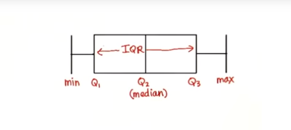
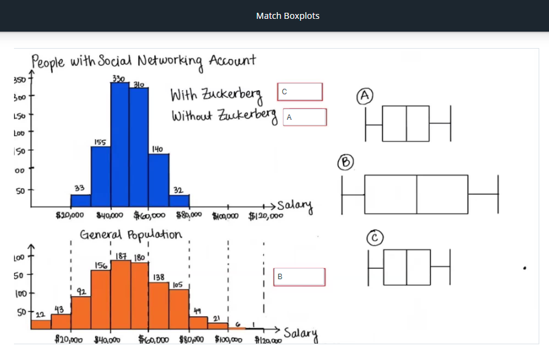
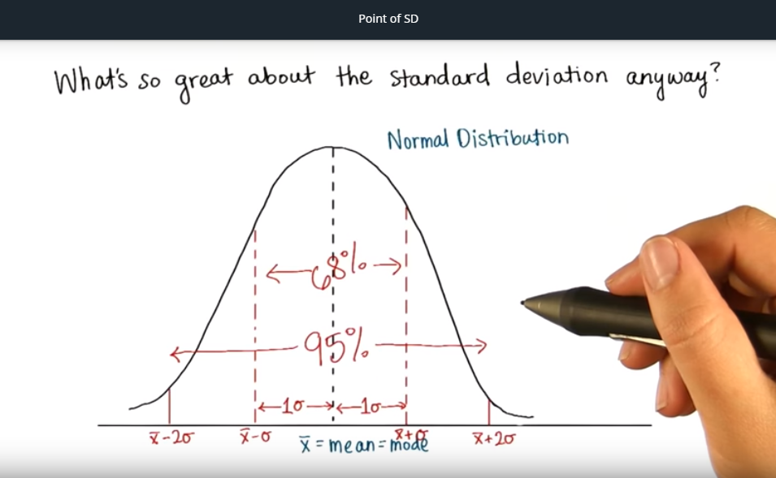
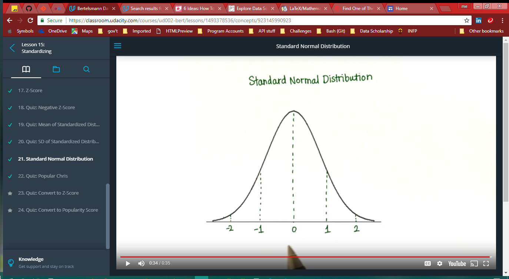
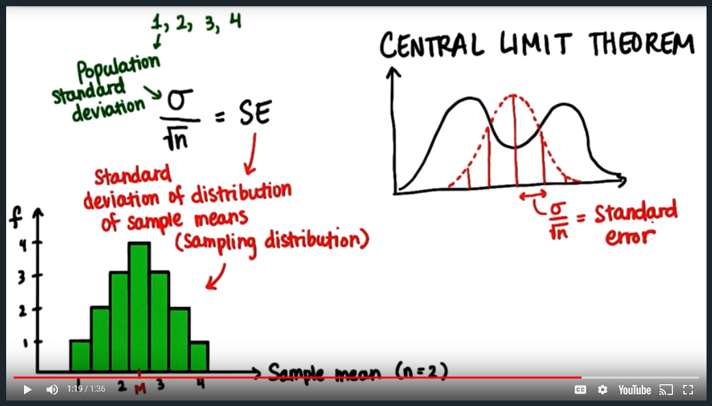

# Descriptive Statistics

<!-- TOC -->

- [1. Intro to Research Methods](#1-intro-to-research-methods)
    - [1.1. Lesson 1 PDF](#11-lesson-1-pdf)
    - [1.2. Constructs](#12-constructs)
    - [1.3. Extraneous Factors](#13-extraneous-factors)
    - [1.4. Population Parameter](#14-population-parameter)
    - [1.5. Sample statistics](#15-sample-statistics)
    - [1.6. Correlation does not prove causation!](#16-correlation-does-not-prove-causation)
    - [1.7. Observational studies](#17-observational-studies)
    - [1.8. Surveys](#18-surveys)
    - [1.9. Controlled experiment](#19-controlled-experiment)
    - [1.10. Within subject design](#110-within-subject-design)
    - [1.11. Indicator Response](#111-indicator-response)
- [2. Visualizing Data](#2-visualizing-data)
    - [2.1. Lesson 2 PDF](#21-lesson-2-pdf)
    - [2.2. Frequency Table](#22-frequency-table)
    - [2.3. Relative Frequency](#23-relative-frequency)
    - [2.4. Bar Chart](#24-bar-chart)
    - [2.5. Bar Graph](#25-bar-graph)
    - [2.6. Histogram](#26-histogram)
    - [2.7. InterActivate is a *histogram software*](#27-interactivate-is-a-histogram-software)
    - [2.8. Normal distribution](#28-normal-distribution)
    - [2.9. Positively skewed distribution](#29-positively-skewed-distribution)
- [3. Central Tendency](#3-central-tendency)
    - [3.1. Lesson 3 PDF](#31-lesson-3-pdf)
    - [3.2. Mode](#32-mode)
    - [3.3. Mean](#33-mean)
    - [3.4. Median](#34-median)
- [4. Variability](#4-variability)
    - [4.1. Lesson 4 PDF](#41-lesson-4-pdf)
    - [4.2. Interquartile Range (IQR)](#42-interquartile-range-iqr)
    - [4.3. Outliers](#43-outliers)
    - [4.4. Boxplots](#44-boxplots)
    - [4.5. Deviation (from the *mean*/average)](#45-deviation-from-the-meanaverage)
    - [4.6. Squared deviations](#46-squared-deviations)
    - [4.7. SS](#47-ss)
    - [4.8. variance](#48-variance)
    - [4.9. Standard Deviation](#49-standard-deviation)
    - [4.10. Bessel's Correction](#410-bessels-correction)
- [5. Standardizing](#5-standardizing)
    - [5.1. Lesson 5 PDF](#51-lesson-5-pdf)
    - [5.2. Standardizing](#52-standardizing)
    - [5.3. Continuous Distribution](#53-continuous-distribution)
    - [5.4. Z](#54-z)
    - [5.5. Z-Score](#55-z-score)
    - [5.6. Standard Normal Distribution](#56-standard-normal-distribution)
- [6. Normal Distribution](#6-normal-distribution)
    - [6.1. Lesson 6 PDF](#61-lesson-6-pdf)
    - [6.2. Normal Distribution](#62-normal-distribution)
    - [6.3. Probability Density Function (PDF)](#63-probability-density-function-pdf)
- [7. Sampling Distributions](#7-sampling-distributions)
    - [7.1. Lesson 7 PDF](#71-lesson-7-pdf)
    - [7.2. Samples:](#72-samples)
    - [7.3. Sampling Distribution](#73-sampling-distribution)
    - [7.4. Expected Value](#74-expected-value)
    - [7.6. Standard Error (SE)](#76-standard-error-se)
    - [7.5. Central Limit Theorem](#75-central-limit-theorem)
    - [Other Key TakeAways](#other-key-takeaways)

<!-- /TOC -->

## 1. Intro to Research Methods

### 1.1. Lesson 1 PDF
- [Lesson 1 PDF](Lesson1.pdf)

### 1.2. Constructs
- In scientific theory, particularly psychology, a hypothetical construct is an explanatory variable which is not directly observable. (itchiness, happiness, stress, intelligence, motivation, etc)

- measured with an **operational definition**.
- For instance, *happiness* could be measured by the ratio of minutes spent smiling to minutes not smiling. Here, the ratio is the **operational definition** of *happiness*.

### 1.3. Extraneous Factors
- aka lurking variables
- things that could influence the outcome, that aren't necessarily considered. (the surprise unknowns)

### 1.4. Population Parameter
- denoted by <code>$\mu$</code> (mu)
- are values that describe the ENTIRE population (as an average)

### 1.5. Sample statistics
- denoted by <code>$\bar{x}$</code> (x-bar)
- are values that describe a sample (the sample that were tested) (as an average)

We use <code>$\bar{x}$</code> to estimate <code>$\mu$</code>.

**Independent** or the **predictor** variable - the x-axis variable

**Dependent** or the **outcome** variable is the y-axis variable

---
---
### 1.6. Correlation does not prove causation!
---
---
### 1.7. Observational studies
- To show relationships.
- Just ask people and you'll see a trend.

### 1.8. Surveys
- a type of observational study
- **response bias** - when respondents don't understand a question
- **non-response bias** - when they refuse to answer a question

### 1.9. Controlled experiment
- to show **causation**
- to deal with all the extraneous factors (lurking variables)

### 1.10. Within subject design
- controlling for variation within a person.
- For example, testing after different amounts of sleep. You're controlling the variation in people's individual memory capabilities, depending on the amounts of sleep they got.

### 1.11. Indicator Response
- ex. Pouched rats scratching near tea eggs containing TNT. So I guess it's *indicating* that TNT is nearby. The humans needed some kind of **indicator response** from the mice to know when there was TNT nearby.

---

## 2. Visualizing Data

### 2.1. Lesson 2 PDF
- [Lesson 2 PDF](Lesson2.pdf)

### 2.2. Frequency Table
- counts the frequency of each data type (ie, if countries, then each country)
- they are whole numbers, obviously, since it's a count.

### 2.3. Relative Frequency
- How much of the whole each data point comprises.
- **Absolute** numbers are whole numbers (12 or 43 out of 50)
    - the sum is the number of data points (<code>$n$</code> or <code>$N$</code>)
- **Proportions** are the fraction written with decimals (.24 or .86)
    - the sum is 1
- **Percentages** are with the <code>%</code> sign (24% or 86%)
    - the sum is 100%

### 2.4. Bar Chart
- measures **frequency** of your data, which is grouped into **intervals** or **bins**
- the **intervals** are on the x-axis
- the **frequency** is on the y-axis

### 2.5. Bar Graph
- data is grouped **categorically** or **qualitatively**
- can't be grouped (much) differently because the groups are distinct categories
- space between data groupings

### 2.6. Histogram
- a type of bar chart
- data is grouped **numerically** or **quantitatively**
- *no* space between data groupings (unless frequency is 0)
- the **intersection of the axes** is (0,0) (Cartesian coordinates)
- can be *biased*! Always look at labels & numbers

### 2.7. InterActivate is a *histogram software*

### 2.8. Normal distribution
- one large, middle peak called the **mode**; symmetrical

### 2.9. Positively skewed distribution
- peak is on the left
- most values on the left

---
## 3. Central Tendency

### 3.1. Lesson 3 PDF
- [Lesson 3 PDF](Lesson3.pdf)

3 measures of center: mode, median, mean

### 3.2. Mode
- most common occurrence - ie, in [1, 2, 3, 4, 4] it's 4
- value at which the *frequency* is highest (the tallest peak)
- can be used for any data - *categorical* or *numerical*
- no actual formula for finding it.

### 3.3. Mean
- the **average** of the distribution
- ALL scores in distribution affect the mean
- mean of a sample denoted by <code>$\bar{x}$</code>
- mean of a population denoted by <code>$\mu$</code>
- formula for a sample: <code>$\bar{x} = \frac{\sum x}{n}$</code>
- formula for a population: <code>$\mu = \frac{\sum x}{N}$</code>
- many samples from the same population will have similar means (!!!)
- the mean of a sample can be used to make inferences about the population it came from (!!!)
- **outliers** - outlying data points that completely skew the average
[tough quiz](https://classroom.udacity.com/courses/ud002-bert/lessons/1489118552/concepts/773143370923)

### 3.4. Median
- value in the middle of the distribution
- if there are 2 numbers, it's the middle of the middles (the average of the middle 2 numbers)
- **ROBUST** = doesn't change much due to outliers
- best measure of central tendencies when dealing with highly skewed distributions
- formula for an even number of values:
<code>$\frac{x_\frac{n}{2} + x_{\frac{n}{2}+1}}{2}$</code>
- formula for an odd number of values: <code>$x_\frac{n+1}{2}$</code>

---
## 4. Variability

### 4.1. Lesson 4 PDF
- [Lesson 4 PDF](Lesson4.pdf)

### 4.2. Interquartile Range (IQR)
- divide the data into quarters, and subract the lower median from the upper median (Q3 - Q1). This is the IQR.
- roughly 50% of data is within this range
- IQR is **not affected by outliers**.
- more or less describes the spread of the data

### 4.3. Outliers
- extreme data points in a distribution
- traditionally cut off top and bottom 25%
- formula to determine outliers: <code>$Outlier < Q_1 - 1.5*(IQR)$</code>
- formula to determine outliers: <code>$Outlier > Q_3 - 1.5*(IQR)$</code>
- traditionally cut off top and bottom 25% of distributions to account for outliers

### 4.4. Boxplots
- used to visualize *quartiles* and *outliers*
- outer lines are the *min* and *max* values that are NOT outliers
- the whole box is the *IQR*
- the box edges are, as shown in image below, *Q1*, *Q2*, and *Q3*
- *outliers* are shown as dots outside of the *min* and *max* lines.

### 4.5. Deviation (from the *mean*/average)
- find the *mean*, then subtract each data point (find the absolute)
- <code>$x_i - \bar{x}$</code> (xi minus x-bar)
- how far from zero it is

### 4.6. Squared deviations
- just the *deviations* squared

### 4.7. SS
- sum of the squared deviations
- formula: <code>$\Sigma(x_i - \bar{x})^2$</code>

### 4.8. variance
- **SS** divided by <code>$n$</code>
- is the average squared deviation
- BUT if we treated the whole as a sample (<code>$n$</code>), it would be divided by (<code>$n - 1$</code>)
    - I don't know why

### 4.9. Standard Deviation
- denoted by (small sigma) <code>$\sigma$</code>
- square root of the variance (which is the average of squared deviations)
- the most common measure of spread
- formula: <code>$\sigma=\sqrt{\frac{\Sigma(x_i - \bar{x})^2}{n}}$</code>
- within a *normal distribution*, 68% of data sample falls within a 'standard deviation' from the mean, and 95% of the data sample falls within 2 'standard deviations' from the mean (see figure!).

### 4.10. Bessel's Correction
In general, samples under-estimate variability in a population because samples tend to be from the middle (especially in normal distribution).
- To correct for this, *Bessel's Correction*
- get average using <code>$(n-1)$</code> instead of <code>$n$</code>
- use this **ONLY** for approximating populations using samples
- it is **NOT** used for a whole population (or small data set)
- if you've got a sample, where <code>$n = 5$</code> and population is <code>$N = 100$</code>, then use Bessel's Correction.
- denoted by (small s) <code>$s$</code>

**Sample standard deviation** is the standard deviation of a sample (not a population), and it uses *Bessel's Correction* to approximate the population. Its formula is: <code>$s \approx \sqrt{\frac{\Sigma(x_i - \bar{x})^2}{n-1}}$</code>

Variance with Bessel's Correction (for a sample): <code>$\frac{\Sigma(x_i = \bar{x})^2}{n-1}$</code>

---
## 5. Standardizing

### 5.1. Lesson 5 PDF
- [Lesson 5 PDF](Lesson5.pdf)

### 5.2. Standardizing
This term is used to compare 2 different distributions (ie Twitter vs Facebook followers). Basically, we compare them using their standard deviations as the common unit. For example, we would compare how many standard deviations away from the mean (which is our zero starting point) that our Z-value is.
- proportion below or above the mean

### 5.3. Continuous Distribution
A theoretical model:
- a theoretically continuous (smooth) distribution that can be described with an equation, which calculates the proportion between ANY 2 points on the x-axis.
- area under the curve should be 1 (same as the sum of all the relative frequencies)

In our theoretical model of a *continuous* and *normal* distribution, the *mean*, *median*, and *mode* are all equal.

### 5.4. Z
- Marks a point on the x-axis of a distribution

### 5.5. Z-Score
- in a standard distribution, the distance in st.dev's away from mean.
    - to calculate this Z-value in terms of standard deviations away from the mean,
we need to know:
        - the Z value/number
        - the mean
        - the standard deviation
    - and then take the difference (mean minus Z) divided by the stand.dev.
- <code>$Z.Score = \frac{x-\mu}{\sigma}$</code> where <code>$x - \mu$</code> will be positive or negative, depending on whether above or below the *mean*.

### 5.6. Standard Normal Distribution
Q: What is the standard deviation of a standardized distribution?

A: The z-score of sigma will be 1:

<code>$Z = \frac{x - \mu}{\sigma} = \frac{\sigma - 0}{\sigma} = 1$</code>

This is called the **Standard Normal Distribution**.

---
## 6. Normal Distribution

### 6.1. Lesson 6 PDF
- [Lesson 6 PDF](Lesson6.pdf)

### 6.2. Normal Distribution
- bell curve with peak in the center
- the tails never actually touch the x-axis, they just infinitely approach it
    - because we can never be 100% sure that there isn't a value further than that; theoretically, you can have an infinite values in a population

### 6.3. Probability Density Function (PDF)
- the curve of a *normal distribution*
- because the area under the curve is 1
    - so we can get the probability of any number on x-axis (aka %)
- there is an extra-curricular equation for this (via calculus)
    - someone created a table for greater ease!
- the *area under the curve* of a normal distribution == the *probability* of randomly selecting less than x == the *proportion* in the sample/population with scores less than x
    - where x is the xth percentile (or the Z)

<code>$s \approx \sqrt{\frac{\Sigma(x_i - \bar{x})^2}{n-1}}$</code>

<code>$Zscore = \frac{\mu -Z}{\sigma}$</code>, and then look up the *area under the curve* on the chart to get the *probability* of data scores less than *X* (or *Z*)

---
## 7. Sampling Distributions

### 7.1. Lesson 7 PDF
- [Lesson 7 PDF](Lesson7.pdf)

With a single data point, we can compare that value to the rest of the values with *% less* or *% greater*.
Similarly, if we have a sample, we can compare that sample to the rest of the samples!

### 7.2. Samples:
- A sample must represent the characteristics of the population.
    - It needs to be *large enough*,
    -  to *have similar characteristics* to the *whole* population
        - ie, if population has 70% women vs men, then sample must have about the same
        - the sample mean should be similar to the population mean.
            - That's how you can tell if your sample is large enough. (??)

### 7.3. Sampling Distribution
- the distribution of samples means is the **sampling distribution**
    - the shape will be a *normal distribution*
    - if we calculate *ALL* the sample means, the mean of these sample means (or, the mean of the *sampling distribution*) will equal the population's mean.
        - <code>if $\mu$ of 100% of sampling distribution, then $\mu = M$</code>

### 7.4. Expected Value
- the mean of a population is the *expected value*, even if it's not a possible outcome (as in dice rolls).
- it means we can expect an outcome somewhere around this value.

### 7.6. Standard Error (SE)
- the standard deviation of the sampling distribution
- the population standard deviation divided by the square root of n: <code>$SE = \frac{\sigma}{\sqrt{n}}$</code>
- So if you have a population size of 1,

### 7.5. Central Limit Theorem
- for any population, if you take enough samples, and plot those samples' means, you'll get roughly a normal distribution
- aka the *standard error (SE)*
- So:
    - the distribution of means,
    - where every mean is the mean of a sample of size <code>$n$</code>,
    - has a standard deviation equal to the population standard deviation divided by the square root of <code>$n$</code>.

### Other Key TakeAways
- the larger the sample size (in a population of samples) (ie. n=2 or n=25),
    - the narrower the histogram/ distribution. Which means:
        - the smaller the *Standard Error*
        - the Z-Score will be bigger for the same data point
        - the less likely to get an outlying data point

---
---

# Python & SQL
