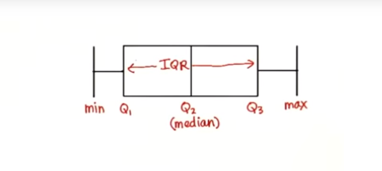
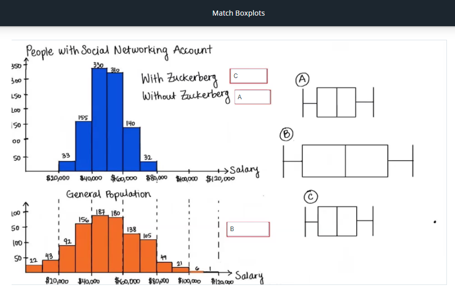
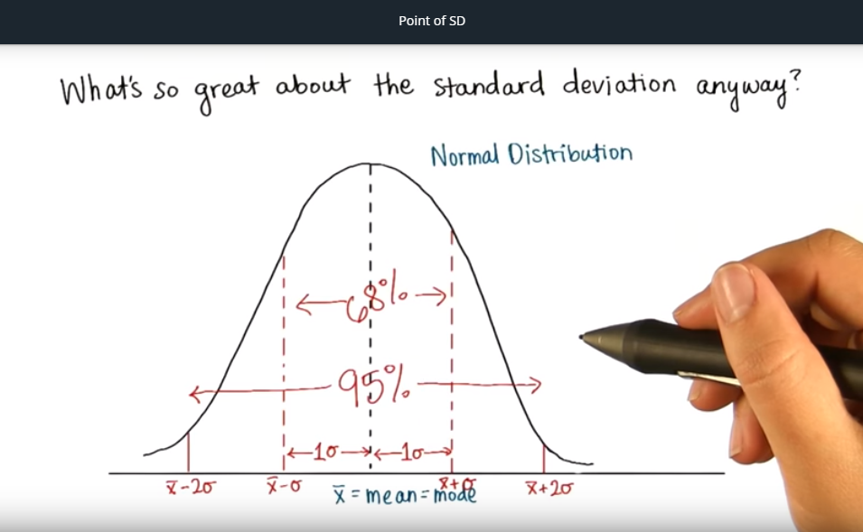

# Descriptive Statistics

## Intro to Research Methods (lesson 3)
### Constructs
- In scientific theory, particularly psychology, a hypothetical construct is an explanatory variable which is not directly observable. (itchiness, happiness, stress, intelligence, motivation, etc)

- measured with an **operational definition**.
- For instance, *happiness* could be measured by the ratio of minutes spent smiling to minutes not smiling. Here, the ratio is the **operational definition** of *happiness*.

### Extraneous Factors
- aka lurking variables
- things that could influence the outcome, that aren't necessarily considered. (the surprise unknowns)

### Population Parameter
- denoted by <code>$\mu$</code> (mu)
- are values that describe the ENTIRE population (as an average)

### Sample statistics
- denoted by <code>$\bar{x}$</code> (x-bar)
- are values that describe a sample (the sample that were tested) (as an average)

We use <code>$\bar{x}$</code> to estimate <code>$\mu$</code>.

**Independent** or the **predictor** variable - the x-axis variable

**Dependent** or the **outcome** variable is the y-axis variable

---
### Correlation does not prove causation!

---
### Observational studies
- To show relationships.
- Just ask people and you'll see a trend.

### Surveys
- a type of observational study
- **response bias** - when respondents don't understand a question
- **non-response bias** - when they refuse to answer a question

### Controlled experiment
- to show **causation**
- to deal with all the extraneous factors (lurking variables)

### Within subject design
- controlling for variation within a person.
- For example, testing after different amounts of sleep. You're controlling the variation in people's individual memory capabilities, depending on the amounts of sleep they got.

### Indicator Response
- ex. Pouched rats scratching near tea eggs containing TNT. So I guess it's *indicating* that TNT is nearby. The humans needed some kind of **indicator response** from the mice to know when there was TNT nearby.

---
## Visualizing Data

### Absolute Frequency
- the whole numbers. Ex. 12 or 43 out of <code>$n = 50$</code>.

### Relative Frequency
- How much of the whole the divided data comprises. Ex. 0.24 or 0.86 (for 12 or 43 out of 50)
- aka **Proportion** - fraction with decimals (as opposed to **percentages**, basically).

### Bar Chart
- measures **frequency** of your data, which is grouped into **intervals** or **bins**
- the **intervals** are on the x-axis
- the **frequency** is on the y-axis

### Bar Graph
- data is grouped **categorically** or **qualitatively**
- can't be grouped (much) differently because the groups are distinct categories
- space between data groupings

### Histogram
- a type of bar chart
- data is grouped **numerically** or **quantitatively**
- *no* space between data groupings (unless frequency is 0)
- the **intersection of the axes** is (0,0) (Cartesian coordinates)
- can be *biased*! Always look at labels & numbers

### InterActivate is a *histogram software*

### Normal distribution
- one large, middle peak called the **mode**; symmetrical

### Positively skewed distribution
- peak is on the left
- most values on the left

---
## Central Tendencies

3 measures of center: mode, median, mean

### Mode
- most common occurrence - ie, in [1, 2, 3, 4, 4] it's 4
- value at which the *frequency* is highest (the tallest peak)
- can be used for any data - *categorical* or *numerical*
- no actual formula for finding it.

### Mean
- the **average** of the distribution
- ALL scores in distribution affect the mean
- mean of a sample denoted by <code>$\bar{x}$</code>
- mean of a population denoted by <code>$\mu$</code>
- formula for a sample: <code>$\bar{x} = \frac{\sum x}{n}$</code>
- formula for a population: <code>$\mu = \frac{\sum x}{N}$</code>
- many samples from the same population will have similar means (!!!)
- the mean of a sample can be used to make inferences about the population it came from (!!!)
- **outliers** - outlying data points that completely skew the average
[tough quiz](https://classroom.udacity.com/courses/ud002-bert/lessons/1489118552/concepts/773143370923)

### Median
- value in the middle of the distribution
- if there are 2 numbers, it's the middle of the middles (the average of the middle 2 numbers)
- **ROBUST** = doesn't change much due to outliers
- best measure of central tendencies when dealing with highly skewed distributions
- formula for an even number of values:
<code>$\frac{x_\frac{n}{2} + x_{\frac{n}{2}+1}}{2}$</code>
- formula for an odd number of values: <code>$x_\frac{n+1}{2}$</code>

---
## Variability

### Interquartile Range (IQR)
- divide the data into quarters, and subract the lower median from the upper median (Q3 - Q1). This is the IQR.
- roughly 50% of data is within this range
- IQR is **not affected by outliers**.
- more or less describes the spread of the data

### Outliers
- extreme data points in a distribution
- traditionally cut off top and bottom 25%
- formula to determine outliers: <code>$Outlier < Q_1 - 1.5*(IQR)$</code>
- formula to determine outliers: <code>$Outlier > Q_3 - 1.5*(IQR)$</code>
- traditionally cut off top and bottom 25% of distributions to account for outliers

### Boxplots
- used to visualize *quartiles* and *outliers*
- outer lines are the *min* and *max* values that are NOT outliers
- the whole box is the *IQR*
- the box edges are, as shown in image below, *Q1*, *Q2*, and *Q3*
- *outliers* are shown as dots outside of the *min* and *max* lines.

### Deviation (from the *mean*/average)
- find the *mean*, then subtract each data point (find the absolute)
- <code>$x_i - \bar{x}$</code> (xi minus x-bar)
- how far from zero it is

### Squared deviations
- just the *deviations* squared

### SS
- sum of the squared deviations
- formula: <code>$\Sigma(x_i - \bar{x})^2$</code>

### variance
- **SS** divided by <code>$n$</code>
- is the average squared deviation
- BUT if we treated the whole as a sample (<code>$n$</code>), it would be divided by (<code>$n - 1$</code>)
    - I don't know why

### Standard Deviation
- square root of the variance (which is the average of squared deviations)
- the most common measure of spread
- denoted by (small sigma) <code>$\sigma$</code>
- formula: <code>$\sigma=\sqrt{\frac{\Sigma(x_i - \bar{x})^2}{n}}$</code>
- within a *normal distribution*, 68% of data sample falls within a 'standard deviation' from the mean, and 95% of the data sample falls within 2 'standard deviations' from the mean (see figure!).

